# Architecture Documentation - Private AKS + ACR Solution

## 🏗️ Overview

This document describes the architecture of a secure, private Azure Kubernetes Service (AKS) cluster integrated with Azure Container Registry (ACR). The solution prioritizes security by keeping the Kubernetes API server completely private while maintaining public access for application traffic.

## 📋 Table of Contents

- [Architecture Overview](#architecture-overview)
- [Network Architecture](#network-architecture)
- [Security Architecture](#security-architecture)
- [Component Details](#component-details)
- [Access Patterns](#access-patterns)
- [Data Flow](#data-flow)
- [Scalability & Performance](#scalability--performance)
- [Cost Optimization](#cost-optimization)
- [Operational Considerations](#operational-considerations)
- [Disaster Recovery](#disaster-recovery)

## 🎯 Architecture Overview

```mermaid
graph TB
    subgraph "Azure Subscription"
        subgraph "Resource Group: rg-acr-demo"
            subgraph "Azure Container Registry"
                ACR[Azure Container Registry<br/>acrmsassignment2025<br/>SKU: Basic<br/>Admin: Enabled]
            end
            
            subgraph "Virtual Network: 10.0.0.0/16"
                subgraph "AKS Nodes Subnet: 10.0.1.0/24"
                    subgraph "Private AKS Cluster"
                        API[🔒 Private API Server<br/>private_cluster_enabled: true<br/>No Public FQDN]
                        
                        subgraph "Node Pool"
                            NODE1[Worker Node 1<br/>Standard_B2s<br/>Ephemeral OS Disk]
                            NODE2[Worker Node 2<br/>Auto-scaling: 1-3]
                            NODE3[Worker Node 3<br/>Optional]
                        end
                        
                        subgraph "System Pods"
                            COREDNS[CoreDNS]
                            KUBE[Kube-proxy]
                            AZURE[Azure CNI]
                        end
                        
                        subgraph "Ingress"
                            NGINX[NGINX Ingress Controller<br/>LoadBalancer Service]
                            LB[Azure Load Balancer<br/>🌐 Public IP]
                        end
                    end
                end
                
                subgraph "Service Network: 10.1.0.0/16"
                    DNS_SVC[DNS Service: 10.1.0.10]
                    K8S_SVCS[Kubernetes Services]
                end
            end
            
            subgraph "Managed Identity & RBAC"
                MSI[System Assigned<br/>Managed Identity]
                KUBELET[Kubelet Identity]
                RBAC[Azure RBAC<br/>AcrPull Role]
            end
        end
        
        subgraph "Azure AD Integration"
            AAD[Azure Active Directory<br/>Managed Integration<br/>RBAC Enabled]
        end
    end
    
    subgraph "Access Methods"
        subgraph "Private Access Only 🔒"
            CLOUDSHELL[Azure Cloud Shell<br/>✅ Recommended]
            JUMPBOX[Jump Box/Bastion<br/>In same VNet]
            VPN[VPN Gateway<br/>Site-to-Site]
            BASTION[Azure Bastion<br/>Secure RDP/SSH]
        end
        
        subgraph "Public Access 🌐"
            INTERNET[Internet Users<br/>via Load Balancer]
            DEVS[Developers<br/>via kubectl]
        end
    end
    
    subgraph "External Services"
        GITHUB[GitHub Actions<br/>CI/CD Pipeline]
        DOCKER[Docker Images<br/>Push/Pull]
    end

    %% Connections
    ACR -.->|AcrPull Role| KUBELET
    KUBELET -.->|Pull Images| ACR
    MSI -.->|Identity| API
    API -.->|Private DNS| COREDNS
    
    %% Private Access
    CLOUDSHELL -.->|kubectl| API
    JUMPBOX -.->|kubectl| API
    VPN -.->|kubectl| API
    BASTION -.->|kubectl| API
    
    %% Public Access
    INTERNET -->|HTTPS/HTTP| LB
    LB --> NGINX
    NGINX --> K8S_SVCS
    
    %% External
    GITHUB -->|Push Images| ACR
    DOCKER -->|Pull Images| ACR
    DEVS -.->|No Direct Access| API
    
    %% Azure AD
    AAD -.->|Authentication| API
    
    classDef private fill:#ff9999,stroke:#333,stroke-width:2px
    classDef public fill:#99ccff,stroke:#333,stroke-width:2px
    classDef secure fill:#99ff99,stroke:#333,stroke-width:2px
    
    class API,CLOUDSHELL,JUMPBOX,VPN,BASTION private
    class LB,INTERNET,NGINX public
    class ACR,MSI,RBAC,AAD secure
```



## 🌐 Network Architecture

### Network Segmentation

| Component | Network Range | Purpose |
|-----------|---------------|---------|
| **Virtual Network** | `10.0.0.0/16` | Main network container |
| **AKS Nodes Subnet** | `10.0.1.0/24` | Worker nodes placement |
| **Service CIDR** | `10.1.0.0/16` | Kubernetes services network |
| **DNS Service IP** | `10.1.0.10` | Internal DNS resolution |

### Network Flow

```mermaid
graph LR
    subgraph "External"
        USER[Internet Users]
        ADMIN[Administrators]
    end
    
    subgraph "Azure Network"
        LB[Load Balancer<br/>Public IP]
        
        subgraph "VNet: 10.0.0.0/16"
            subgraph "AKS Subnet: 10.0.1.0/24"
                NGINX[NGINX Ingress]
                PODS[Application Pods]
                API[🔒 Private API Server]
            end
            
            subgraph "Service Network: 10.1.0.0/16"
                SVC[Kubernetes Services]
                DNS[DNS: 10.1.0.10]
            end
        end
        
        SHELL[Azure Cloud Shell]
    end
    
    USER -->|HTTPS/HTTP| LB
    LB --> NGINX
    NGINX --> SVC
    SVC --> PODS
    
    ADMIN -.->|No Direct Access| API
    SHELL -.->|kubectl (Private)| API
    
    API -.->|Internal| DNS
    PODS -.->|Service Discovery| DNS
```

## 🔐 Security Architecture

### Security Layers

#### 1. **Network Security**
- **Private API Server**: No public endpoint for Kubernetes API
- **Network Isolation**: Complete VNet isolation for cluster components
- **Private DNS**: System-managed private DNS zones
- **Subnet Segmentation**: Dedicated subnet for AKS nodes

#### 2. **Identity & Access Management**
- **Azure AD Integration**: Managed Azure AD integration
- **RBAC**: Azure Role-Based Access Control enabled
- **Managed Identity**: System-assigned managed identity
- **Service Principal**: Kubelet identity for ACR access

#### 3. **Container Security**
- **Private Registry**: Azure Container Registry integration
- **Image Scanning**: Built-in vulnerability scanning (ACR Premium)
- **Role Assignment**: AcrPull role for secure image pulls
- **Admin Access**: Controlled admin access to ACR

### Security Configuration

```yaml
# AKS Security Settings
private_cluster_enabled: true
private_cluster_public_fqdn_enabled: false
private_dns_zone_id: "System"
role_based_access_control_enabled: true

# Azure AD Integration
azure_active_directory_role_based_access_control:
  managed: true
  azure_rbac_enabled: true

# Network Security
network_profile:
  network_plugin: "azure"
  network_policy: "azure"
  load_balancer_sku: "standard"
```

## 🔧 Component Details

### Azure Kubernetes Service (AKS)

| Configuration | Value | Purpose |
|---------------|-------|---------|
| **Cluster Name** | `aks-demo-cluster` | Unique cluster identifier |
| **SKU Tier** | `Free` | Cost-optimized tier |
| **Kubernetes Version** | `Latest Stable` | Auto-managed version |
| **DNS Prefix** | `aks-demo` | Cluster DNS prefix |
| **Node Pool** | `default` | Primary worker node pool |

### Node Pool Configuration

| Setting | Value | Rationale |
|---------|-------|-----------|
| **VM Size** | `Standard_B2s` | Burstable, cost-effective |
| **Node Count** | `1` (default) | Minimal for demo |
| **Auto-scaling** | `1-3 nodes` | Flexible scaling |
| **OS Disk Type** | `Ephemeral` | Cost optimization |
| **OS Disk Size** | `30 GB` | Minimal required size |

### Azure Container Registry (ACR)

| Configuration | Value | Purpose |
|---------------|-------|---------|
| **Name** | `acrmsassignment2025` | Unique registry name |
| **SKU** | `Basic` | Cost-optimized tier |
| **Admin Enabled** | `true` | Simplified access |
| **Public Access** | `Enabled` | CI/CD integration |

## 🚪 Access Patterns

### Private Access (Cluster Management) 🔒

#### 1. **Azure Cloud Shell** ✅ *Recommended*
```bash
# Access via Azure Portal Cloud Shell
az aks get-credentials --resource-group rg-acr-demo --name aks-demo-cluster
kubectl get nodes
```

**Benefits:**
- Pre-configured environment
- No additional setup required
- Direct access to private clusters
- Integrated with Azure CLI

#### 2. **Jump Box/Bastion Host**
```bash
# Deploy VM in same VNet
az vm create --resource-group rg-acr-demo \
  --name jumpbox \
  --image UbuntuLTS \
  --subnet aks-nodes-subnet \
  --vnet-name aks-demo-cluster-vnet

# Install tools and get credentials
sudo apt-get update
sudo apt-get install -y azure-cli kubectl
az aks get-credentials --resource-group rg-acr-demo --name aks-demo-cluster
```

#### 3. **VPN Gateway**
```bash
# Create VPN Gateway (if needed)
az network vnet-gateway create \
  --resource-group rg-acr-demo \
  --name aks-vpn-gateway \
  --vnet aks-demo-cluster-vnet \
  --gateway-type Vpn \
  --vpn-type RouteBased \
  --sku VpnGw1
```

#### 4. **Azure Bastion**
```bash
# Deploy Azure Bastion
az network bastion create \
  --resource-group rg-acr-demo \
  --name aks-bastion \
  --vnet-name aks-demo-cluster-vnet \
  --location westeurope
```

### Public Access (Application Traffic) 🌐

#### Load Balancer Configuration
```yaml
# NGINX Ingress Service
apiVersion: v1
kind: Service
metadata:
  name: nginx-ingress-controller
spec:
  type: LoadBalancer
  ports:
  - port: 80
    targetPort: 80
  - port: 443
    targetPort: 443
  selector:
    app: nginx-ingress-controller
```

## 📊 Data Flow

### Container Image Flow


### Application Traffic Flow


## 📈 Scalability & Performance

### Horizontal Scaling

| Component | Scaling Method | Configuration |
|-----------|----------------|---------------|
| **Nodes** | Cluster Autoscaler | 1-3 nodes |
| **Pods** | Horizontal Pod Autoscaler | CPU/Memory based |
| **Ingress** | Multiple replicas | 1-3 replicas |
| **Applications** | Kubernetes Deployments | Custom scaling |

### Performance Optimization

```yaml
# Node Pool Optimization
default_node_pool:
  vm_size: "Standard_B2s"          # Burstable performance
  os_disk_type: "Ephemeral"        # Faster I/O
  enable_auto_scaling: true        # Dynamic scaling
  min_count: 1                     # Cost optimization
  max_count: 3                     # Performance limit

# Network Optimization
network_profile:
  network_plugin: "azure"          # Native Azure networking
  network_policy: "azure"          # Built-in security
  load_balancer_sku: "standard"    # High availability
```

## 💰 Cost Optimization

### Resource Sizing

| Resource | Configuration | Monthly Cost (Est.) |
|----------|---------------|-------------------|
| **AKS Cluster** | Free tier | $0 |
| **VM Nodes** | 1x Standard_B2s | ~$30 |
| **Load Balancer** | Standard | ~$20 |
| **ACR** | Basic tier | ~$5 |
| **Storage** | Ephemeral disks | ~$5 |
| **Total** | | **~$60/month** |

### Cost Optimization Strategies

1. **Free AKS Tier**: No management fees
2. **Burstable VMs**: Pay for actual usage
3. **Ephemeral Disks**: No additional storage costs
4. **Basic ACR**: Minimal registry costs
5. **Auto-scaling**: Scale down when not needed

## 🔧 Operational Considerations

### Monitoring & Logging

```bash
# Enable Container Insights
az aks enable-addons \
  --resource-group rg-acr-demo \
  --name aks-demo-cluster \
  --addons monitoring
```

### Backup & Recovery

```bash
# Backup cluster configuration
kubectl get all --all-namespaces -o yaml > cluster-backup.yaml

# Export persistent volumes
kubectl get pv -o yaml > pv-backup.yaml
```

### Maintenance Windows

```yaml
# Maintenance configuration
maintenance_window:
  allowed:
    - day: "Sunday"
      hours: ["02:00", "04:00"]
  not_allowed:
    - start: "2024-12-24T00:00:00Z"
      end: "2024-12-26T23:59:59Z"
```

## 🚨 Disaster Recovery

### Recovery Time Objectives (RTO)

| Component | RTO Target | Recovery Method |
|-----------|------------|-----------------|
| **AKS Cluster** | 30 minutes | Terraform redeploy |
| **Applications** | 15 minutes | GitOps/Helm |
| **Data** | 5 minutes | Azure Backup |
| **Network** | 10 minutes | Infrastructure as Code |

### Backup Strategy

```bash
# Automated backup script
#!/bin/bash
DATE=$(date +%Y%m%d)
BACKUP_DIR="/backups/$DATE"

# Backup Kubernetes resources
kubectl get all --all-namespaces -o yaml > $BACKUP_DIR/k8s-resources.yaml

# Backup Terraform state
terraform state pull > $BACKUP_DIR/terraform.tfstate

# Upload to Azure Storage
az storage blob upload-batch \
  --destination backups \
  --source $BACKUP_DIR \
  --account-name backupstorage
```

## 📚 References

### Documentation Links
- [AKS Private Clusters](https://docs.microsoft.com/en-us/azure/aks/private-clusters)
- [Azure Container Registry](https://docs.microsoft.com/en-us/azure/container-registry/)
- [Azure CNI Networking](https://docs.microsoft.com/en-us/azure/aks/configure-azure-cni)
- [NGINX Ingress Controller](https://kubernetes.github.io/ingress-nginx/)

### Best Practices
- [AKS Security Best Practices](https://docs.microsoft.com/en-us/azure/aks/security-best-practices)
- [Container Security](https://docs.microsoft.com/en-us/azure/security/fundamentals/container-security)
- [Kubernetes Network Policies](https://kubernetes.io/docs/concepts/services-networking/network-policies/)

---

**Document Version**: 1.0  
**Last Updated**: $(date)  
**Maintained By**: Infrastructure Team  
**Review Cycle**: Quarterly