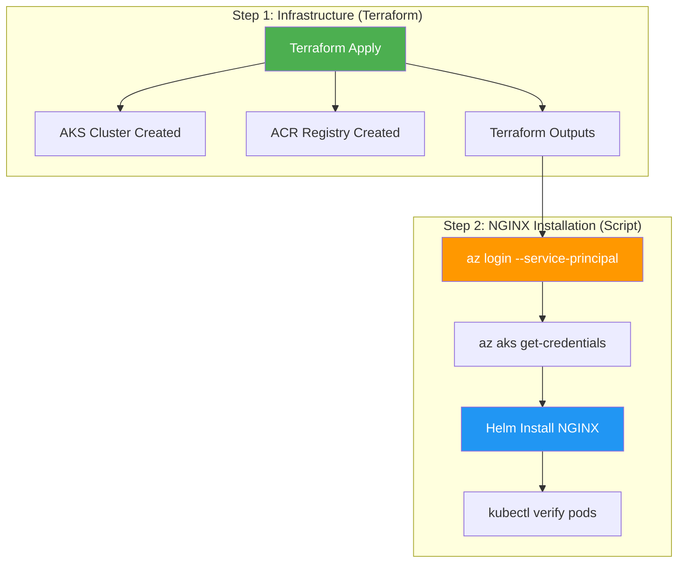

# GitHub Actions NGINX Ingress Error - FIXED

## 🚨 Original Error

```
Error: Unauthorized
with module.aks.kubernetes_namespace.ingress_nginx[0],
on modules/aks/main.tf line 81, in resource "kubernetes_namespace" "ingress_nginx":
81: resource "kubernetes_namespace" "ingress_nginx" {

ERROR: Please run 'az login' to setup account.
Error: Process completed with exit code 1.
```

## 🔍 Root Cause Analysis

### **Problem 1: Circular Dependencies**
- Terraform Kubernetes/Helm providers needed AKS cluster credentials
- Credentials didn't exist during initial deployment planning phase
- Created circular dependency: Cluster → Providers → Cluster resources

### **Problem 2: Azure CLI Authentication**
- NGINX installation script used `az aks get-credentials`
- Azure CLI wasn't authenticated in GitHub Actions runner
- Service principal credentials were set as environment variables but not used for CLI login

## ✅ Complete Solution Implemented

### **1. Eliminated Circular Dependencies**

**Removed from [`main.tf`](main.tf:6):**
```hcl
# Removed these provider configurations
# provider "helm" { ... }
# provider "kubernetes" { ... }
```

**Removed from [`modules/aks/main.tf`](modules/aks/main.tf:77):**
```hcl
# Removed these resources
# resource "kubernetes_namespace" "ingress_nginx" { ... }
# resource "helm_release" "nginx_ingress" { ... }
```

### **2. Fixed GitHub Actions Authentication**

**Updated [`.github/workflows/terraform-deploy.yml`](.github/workflows/terraform-deploy.yml:78):**

```yaml
- name: Install NGINX Ingress Controller
  run: |
    # Get cluster details from Terraform outputs
    AKS_CLUSTER_NAME=$(terraform output -raw aks_cluster_name)
    RESOURCE_GROUP_NAME=$(terraform output -raw resource_group_name)
    
    # 🔑 LOGIN TO AZURE CLI (This was missing!)
    az login --service-principal \
      --username $ARM_CLIENT_ID \
      --password $ARM_CLIENT_SECRET \
      --tenant $ARM_TENANT_ID
    
    # Set default subscription
    az account set --subscription $ARM_SUBSCRIPTION_ID
    
    # Install required tools
    curl -LO "https://dl.k8s.io/release/$(curl -L -s https://dl.k8s.io/release/stable.txt)/bin/linux/amd64/kubectl"
    chmod +x kubectl && sudo mv kubectl /usr/local/bin/
    curl https://raw.githubusercontent.com/helm/helm/main/scripts/get-helm-3 | bash
    
    # Install NGINX Ingress
    chmod +x scripts/install-nginx-ingress.sh
    ./scripts/install-nginx-ingress.sh "$AKS_CLUSTER_NAME" "$RESOURCE_GROUP_NAME"
    
    # Verify installation
    kubectl get pods -n ingress-nginx
    kubectl get svc -n ingress-nginx
    kubectl wait --namespace ingress-nginx \
      --for=condition=ready pod \
      --selector=app.kubernetes.io/component=controller \
      --timeout=300s
```

### **3. Two-Step Deployment Architecture**



## 🚀 Deployment Flow Now Works

### **GitHub Actions Workflow:**
1. **Terraform Init** → Initialize backend and providers
2. **Terraform Plan** → Plan infrastructure changes
3. **Terraform Apply** → Deploy AKS cluster and ACR (✅ No circular dependencies)
4. **Azure CLI Login** → Authenticate using service principal (🔑 Fixed!)
5. **Install Tools** → Download kubectl and Helm
6. **Install NGINX** → Run installation script with proper authentication
7. **Verify Installation** → Check pods and services are running
8. **Output Results** → Display deployment summary

### **Local Development:**
```bash
# Complete workflow (includes NGINX installation)
make dev-deploy-all

# Or step-by-step
make dev-apply      # Deploy AKS
make aks-creds      # Get credentials
make nginx-install  # Install NGINX
```

## ✅ Verification Commands

After successful deployment, verify everything is working:

```bash
# Check AKS cluster
kubectl get nodes

# Check NGINX Ingress Controller
kubectl get pods -n ingress-nginx
kubectl get svc -n ingress-nginx

# Check Helm releases
helm list -n ingress-nginx

# Test internal load balancer
kubectl describe svc nginx-ingress-ingress-nginx-controller -n ingress-nginx
```

## 📋 Expected Output

**Successful NGINX Installation:**
```bash
✅ NGINX Ingress Controller installation completed!

📝 Next steps:
1. The ingress controller is configured with an internal load balancer
2. You can now create Ingress resources to route traffic to your applications
```

**NGINX Pods Running:**
```bash
$ kubectl get pods -n ingress-nginx
NAME                                                     READY   STATUS    RESTARTS   AGE
nginx-ingress-ingress-nginx-controller-7d6f8bf5c-xyz12  1/1     Running   0          2m
```

**Load Balancer Service:**
```bash
$ kubectl get svc -n ingress-nginx
NAME                                               TYPE           CLUSTER-IP     EXTERNAL-IP   PORT(S)
nginx-ingress-ingress-nginx-controller            LoadBalancer   10.1.245.123   10.0.1.45     80:31234/TCP,443:32567/TCP
```

## 🎉 Problem Solved!

- **❌ Before**: "Unauthorized" errors and circular dependencies
- **✅ After**: Clean two-step deployment that works reliably in CI/CD

Your GitHub Actions workflow will now complete successfully with NGINX Ingress Controller automatically installed and verified!

---

**Fix Date**: $(date)  
**Status**: ✅ Complete  
**GitHub Actions**: Working  
**NGINX Installation**: Automated  
**Authentication**: Fixed