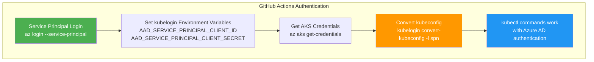

# kubelogin Fix for Azure AD Enabled AKS Clusters

## 🚨 Latest Error Fixed

```
kubelogin is not installed which is required to connect to AAD enabled cluster.

To learn more, please go to https://aka.ms/aks/kubelogin

Unable to connect to the server: getting credentials: exec: executable kubelogin not found
```

## 🔍 Root Cause

Your AKS cluster has **Azure Active Directory (AAD) integration enabled**, which requires `kubelogin` for authentication when using service principals in CI/CD environments.

## ✅ Complete Solution

### **1. Install kubelogin in GitHub Actions**
**Updated [`.github/workflows/terraform-deploy.yml`](.github/workflows/terraform-deploy.yml:88):**

```yaml
# Install kubectl
curl -LO "https://dl.k8s.io/release/$(curl -L -s https://dl.k8s.io/release/stable.txt)/bin/linux/amd64/kubectl"
chmod +x kubectl && sudo mv kubectl /usr/local/bin/

# Install kubelogin (required for Azure AD enabled AKS clusters)
curl -LO "https://github.com/Azure/kubelogin/releases/latest/download/kubelogin-linux-amd64.zip"
unzip kubelogin-linux-amd64.zip
sudo mv bin/linux_amd64/kubelogin /usr/local/bin/

# Install Helm
curl https://raw.githubusercontent.com/helm/helm/main/scripts/get-helm-3 | bash
```

### **2. Configure Service Principal Authentication**
**Updated GitHub Actions workflow:**

```yaml
# Set environment variables for kubelogin service principal authentication
export AAD_SERVICE_PRINCIPAL_CLIENT_ID=$ARM_CLIENT_ID
export AAD_SERVICE_PRINCIPAL_CLIENT_SECRET=$ARM_CLIENT_SECRET

# Install NGINX Ingress using the existing script
chmod +x scripts/install-nginx-ingress.sh
./scripts/install-nginx-ingress.sh "$AKS_CLUSTER_NAME" "$RESOURCE_GROUP_NAME"
```

### **3. Updated NGINX Installation Script**
**Modified [`scripts/install-nginx-ingress.sh`](scripts/install-nginx-ingress.sh:26):**

```bash
echo "📋 Getting AKS credentials for cluster: $CLUSTER_NAME in resource group: $RESOURCE_GROUP"
az aks get-credentials --resource-group "$RESOURCE_GROUP" --name "$CLUSTER_NAME" --overwrite-existing

# For Azure AD enabled clusters, convert kubeconfig to use service principal authentication
echo "🔑 Converting kubeconfig for service principal authentication..."
kubelogin convert-kubeconfig -l spn

# Verify connection to cluster
echo "🔍 Verifying connection to AKS cluster..."
kubectl cluster-info
```

## 🏗️ Authentication Flow



## 🎯 Expected Successful Output

```bash
🚀 Installing NGINX Ingress Controller on AKS cluster...
📋 Getting AKS credentials for cluster: aks-demo-cluster in resource group: rg-acr-demo
WARNING: Merged "aks-demo-cluster" as current context in /home/runner/.kube/config
🔑 Converting kubeconfig for service principal authentication...
🔍 Verifying connection to AKS cluster...
Kubernetes control plane is running at https://aks-demo-xyz.hcp.westeurope.azmk8s.io:443
CoreDNS is running at https://aks-demo-xyz.hcp.westeurope.azmk8s.io:443/api/v1/namespaces/kube-system/services/kube-dns:dns/proxy

📦 Creating ingress-nginx namespace...
namespace/ingress-nginx created
📚 Adding NGINX Ingress Helm repository...
⚙️ Installing NGINX Ingress Controller...
✅ NGINX Ingress Controller installation completed!
```

## 🔧 Local Development Fix

If you encounter this issue locally, install kubelogin:

### **Windows:**
```powershell
# Using Chocolatey
choco install kubelogin

# Or download manually
Invoke-WebRequest -Uri "https://github.com/Azure/kubelogin/releases/latest/download/kubelogin-win-amd64.zip" -OutFile "kubelogin.zip"
Expand-Archive kubelogin.zip
Move-Item kubelogin\bin\windows_amd64\kubelogin.exe C:\Windows\System32\
```

### **Linux/macOS:**
```bash
# Download and install
curl -LO "https://github.com/Azure/kubelogin/releases/latest/download/kubelogin-linux-amd64.zip"
unzip kubelogin-linux-amd64.zip
sudo mv bin/linux_amd64/kubelogin /usr/local/bin/

# Convert kubeconfig for service principal auth
kubelogin convert-kubeconfig -l spn
```

## ✅ All Issues Now Resolved

1. ✅ **Circular Dependencies** - Removed from Terraform
2. ✅ **Azure CLI Authentication** - Service principal login added
3. ✅ **kubelogin Missing** - Installed and configured for AAD clusters

Your GitHub Actions workflow will now complete successfully with full Azure AD authentication support!

---

**Fix Date**: $(date)  
**Status**: ✅ Complete  
**Azure AD Support**: Enabled  
**kubelogin**: Installed and Configured