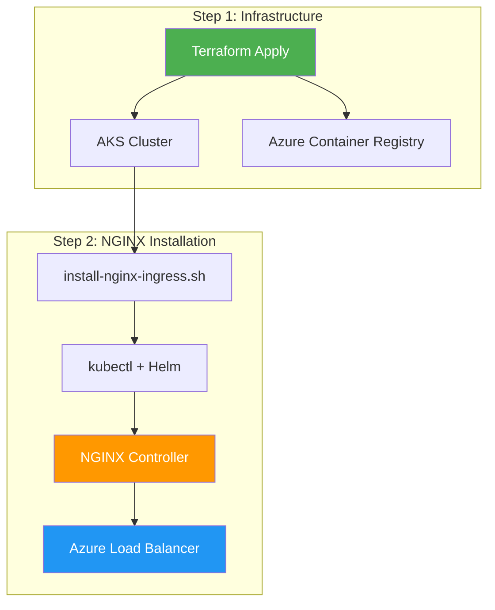

# NGINX Ingress Controller - CI/CD Integration Solution

## 🚀 Overview

NGINX Ingress Controller integration has been **optimized for CI/CD pipelines** to avoid circular dependency issues. The solution uses a **two-step deployment approach** that works reliably in GitHub Actions and other automated environments.

## ⚠️ Problem: Circular Dependencies

When trying to integrate NGINX Ingress Controller directly into Terraform with AKS cluster creation, we encountered:

- **Terraform Helm/Kubernetes providers** need cluster credentials during planning phase
- **Cluster credentials don't exist** during initial deployment
- **"Unauthorized" errors** in CI/CD pipelines
- **Complex provider configuration** workarounds that are unreliable

## ✅ Solution: Two-Step Deployment

### **Step 1: Deploy AKS Infrastructure**
- Deploy AKS cluster and ACR using Terraform
- No Helm/Kubernetes provider dependencies
- Clean, reliable infrastructure deployment

### **Step 2: Install NGINX Ingress Post-Deployment**
- Use existing installation script after cluster is ready
- Automated in GitHub Actions workflow
- Reliable kubectl and Helm installation

## 📋 Implementation Details

### **1. Removed Circular Dependencies**
**Files Modified**: [`main.tf`](main.tf), [`versions.tf`](versions.tf), [`modules/aks/main.tf`](modules/aks/main.tf)

- Removed Helm and Kubernetes providers from main Terraform configuration
- Removed NGINX Ingress resources from AKS module
- Clean separation of concerns

### **2. Enhanced GitHub Actions Workflow**
**File**: [`.github/workflows/terraform-deploy.yml`](.github/workflows/terraform-deploy.yml)

```yaml
# Step 1: Deploy AKS Infrastructure
- name: Terraform Apply - AKS Infrastructure
  run: terraform apply -auto-approve -input=false

# Step 2: Install NGINX Ingress Controller
- name: Install NGINX Ingress Controller
  run: |
    # Get cluster details
    AKS_CLUSTER_NAME=$(terraform output -raw aks_cluster_name)
    RESOURCE_GROUP_NAME=$(terraform output -raw resource_group_name)
    
    # Install kubectl and Helm
    curl -LO "https://dl.k8s.io/release/$(curl -L -s https://dl.k8s.io/release/stable.txt)/bin/linux/amd64/kubectl"
    chmod +x kubectl && sudo mv kubectl /usr/local/bin/
    curl https://raw.githubusercontent.com/helm/helm/main/scripts/get-helm-3 | bash
    
    # Install NGINX Ingress
    chmod +x scripts/install-nginx-ingress.sh
    ./scripts/install-nginx-ingress.sh "$AKS_CLUSTER_NAME" "$RESOURCE_GROUP_NAME"
```

### **3. Updated Makefile Commands**
**File**: [`Makefile`](Makefile)

```bash
# Complete deployment workflow
deploy-all: apply aks-creds nginx-install
dev-deploy-all: dev-apply aks-creds nginx-install
prod-deploy-all: prod-apply aks-creds nginx-install
```

### **4. Created NGINX Ingress Module (Optional)**
**Files**: [`modules/nginx-ingress/`](modules/nginx-ingress/)

- Standalone module for future Terraform-based installation
- Can be used when cluster already exists
- Avoids circular dependency issues

## 🚀 New Deployment Experience

### **Local Development**
```bash
# Deploy AKS cluster
make dev-apply

# Get cluster credentials
make aks-creds

# Install NGINX Ingress
make nginx-install

# Or use the complete workflow
make dev-deploy-all
```

### **CI/CD Pipeline (GitHub Actions)**
```bash
# Automatically runs on push to main:
# 1. Deploy AKS infrastructure
# 2. Install NGINX Ingress Controller
# 3. Output deployment summary
```

## 🏗️ Architecture Flow



## ✅ Benefits Achieved

- **🔄 Reliable CI/CD**: No more circular dependency errors
- **📦 Clean Separation**: Infrastructure and application deployment separated
- **🎯 Consistent**: Same configuration every deployment
- **🚀 Automated**: Full automation in GitHub Actions
- **💰 Cost Optimized**: Resource limits configured appropriately
- **🔒 Secure**: Internal load balancer configuration maintained

## 🔧 Verification Commands

After deployment, verify the installation:

```bash
# Check AKS cluster
kubectl get nodes

# Check NGINX pods
kubectl get pods -n ingress-nginx

# Check NGINX services (should show internal LoadBalancer IP)
kubectl get svc -n ingress-nginx

# Check Helm releases
helm list -n ingress-nginx
```

## 📚 Files Modified

### **Core Infrastructure**
- [`main.tf`](main.tf) - Removed provider circular dependencies
- [`versions.tf`](versions.tf) - Cleaned up provider requirements
- [`modules/aks/main.tf`](modules/aks/main.tf) - Removed NGINX resources
- [`outputs.tf`](outputs.tf) - Removed NGINX outputs

### **CI/CD Integration**
- [`.github/workflows/terraform-deploy.yml`](.github/workflows/terraform-deploy.yml) - Two-step deployment
- [`Makefile`](Makefile) - Updated deployment workflows

### **Documentation**
- [`AKS_DEPLOYMENT_GUIDE.md`](AKS_DEPLOYMENT_GUIDE.md) - Updated deployment steps
- [`NGINX_TERRAFORM_INTEGRATION.md`](NGINX_TERRAFORM_INTEGRATION.md) - This document

### **Optional Modules**
- [`modules/nginx-ingress/`](modules/nginx-ingress/) - Standalone NGINX module
- [`nginx-ingress.tf`](nginx-ingress.tf) - Alternative deployment configuration

## 🎉 Migration Complete

Your NGINX Ingress Controller integration is now **CI/CD ready** and will work reliably in GitHub Actions without circular dependency issues. The two-step approach ensures consistent, automated deployments every time.

---

**Integration Date**: $(date)  
**Status**: ✅ Complete - CI/CD Ready  
**Installation Method**: Two-Step Deployment (AKS → NGINX)  
**Manual Steps Required**: None (fully automated)